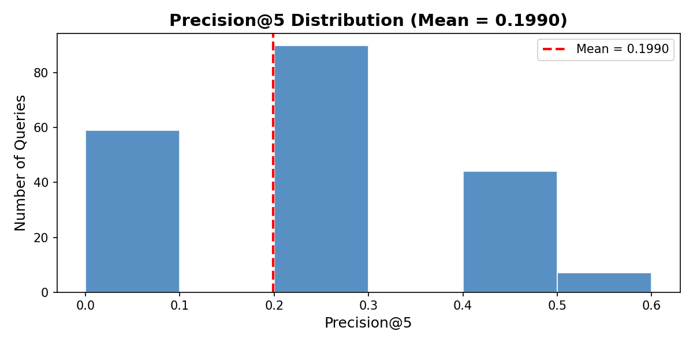

# HSRIS - Hybrid Semantic Retrieval & Intelligence System

## Assignment 3 - Data Science for Software Engineering
**Group Members:**
- Ali Naqi (23F-3052)
- Muhammad Aamir (23F-3073)
**Section:** SE-6B

---

## 📌 Project Overview
The **Hybrid Semantic Retrieval & Intelligence System (HSRIS)** is a custom-built Natural Language Processing (NLP) pipeline designed to intelligently analyze and retrieve relevant Customer Support Tickets based on user queries.

Built entirely from scratch using **PyTorch** and **NumPy** (strictly bypassing Scikit-Learn as per assignment constraints), the system implements a hybrid search mechanism that combines:
1. **Keyword Matching (Custom TF-IDF)** - Utilizing sparse COOrdinate tensors to prevent memory exhaustion and handle large datasets efficiently.
2. **Semantic Understanding (GloVe 300d)** - Using pre-trained word embeddings and TF-IDF weighted mean pooling to comprehend the contextual meaning of queries.

The final similarity score is calculated using an adjustable alpha ($\alpha$) weight:  
`FinalScore = α × CosineSim(TF-IDF) + (1 - α) × CosineSim(GloVe)`

## 🚀 Key Features & Implementation
- **Custom NLP Pipeline:** Built custom `CustomLabelEncoder`, `CustomOneHotEncoder`, and RegEx tokenizers without external ML libraries.
- **N-Gram Generation:** Extracts unigrams, bigrams, and trigrams dynamically.
- **Memory-Safe Sparse Tensors:** Designed specifically for Kaggle's T4 x2 GPU environment to safely process a 5000+ vocabulary size.
- **Robust OOV Handling:** Safe handling for Out-of-Vocabulary words during inference (zero-vectors for unknown words).
- **Dual GPU Acceleration:** Uses `torch.nn.DataParallel` to distribute the computationally heavy tensor matrix multiplications.
- **Premium Interactive UI:** A high-end Streamlit Application featuring dark glassmorphism styling, animated CSS gradients, and real-time adjustable hybrid weighting.

## 🛠️ Tech Stack
- **Core Engine:** PyTorch (`torch.sparse`, `torch.nn`)
- **Data Manipulation:** NumPy, Pandas
- **Frontend / Deployment:** Streamlit (Custom CSS injected)
- **Environment:** Kaggle T4 x2 Dual GPU

## 📈 Evaluation & Metrics
The system's retrieval performance was evaluated using **Precision@5** across a benchmark of 100 test queries. The application logs batch query execution times and plots the distribution of precision scores to validate semantic improvements over pure keyword search.

## 💻 Repository Contents
- `DS_ASS01_23F_3052.ipynb`: The complete PyTorch NLP pipeline and evaluation notebook.
- `streamlit_app.py`: The premium Streamlit deployment script.
- `hsris_app_data.pkl`: Pre-computed TF-IDF, IDF, Vocabulary, and Embedding dictionaries for fast Streamlit loading (Tracked via Git LFS).
- `requirements.txt`: Cloud deployment dependencies.
